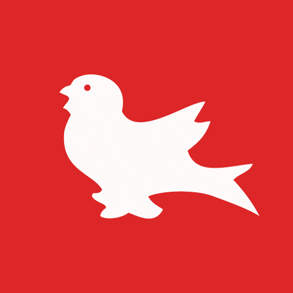

<!-- Abdullah Saad | GitHub Profile README  -->

  

  
   
  

  
  
  
  

> 💬 *“The best developer tools are the ones that disappear into your workflow.”*
---

Hi, I’m **Abdullah Saad** , a software engineer and graduate researcher at **McGill University** 🇨🇦, focused on building tools that empower developers and automate documentation workflows.

<table align="center">
  <tr>
    <td align="center">
       
      <b>McGill University</b> 
      MSc (Thesis), Computer Science
    </td>
    <td align="center">
       
      <b>University of Guelph</b> 
      BSc, Software Engineering + Economics
    </td>
    <td align="center">
       
      <b>University of Bremen</b> 
      Erasmus+ Scholar (Germany)
    </td>
  </tr>
</table>

🔬 **Research Interests:**
- Developer-Centered Compiler Infrastructure  
- API Usability & Program Comprehension  
- NLP for Software Engineering  
- Automation for Documentation & Traceability

**🔬 Focus Areas**  
> • Documentation Automation  •Compiler Tooling • API Usability • NLP for SE • Traceability Links 

---

## Projects in Progress

- Building compiler plugins for automated documentation  
- Enhancing traceability using LLMs & NLP  
- Creating internal tools for large-scale software systems  

<h2 align="center">⚙️ Tech Stack</h2>

<table align="center" width="100%">
  <tr>
    <td align="center" colspan="2">
      
       
      
    </td>
  </tr>
  <tr>
    <td align="center">
      
       
      
    </td>
    <td align="center">
      
       
      
    </td>
  </tr>
  <tr>
    <td align="center">
      
       
      
    </td>
    <td align="center">
      
       
      
    </td>
  </tr>
  <tr>
    <td align="center" colspan="2">
      
       
      
    </td>
  </tr>
</table>

---

<!-- Looping header -->

  

<!--  Streak Chart -->

  

<!--  Contributions & Language Breakdown -->

  
  

<!--  Contribution Graph -->

  

---

<!--  Typing Animation for Engagement -->

  

<!--  Stylish Call-To-Actions -->

  
  &nbsp;
  

<!--  Thank You Typing Loop -->

  

---

<!-- README crafted with excellence by Abdullah Saad -->
